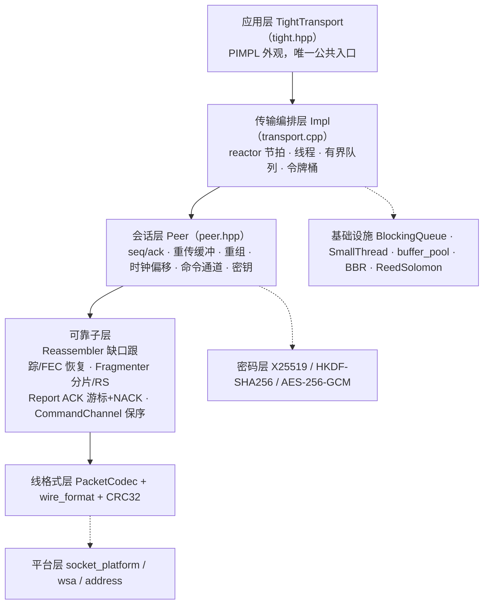
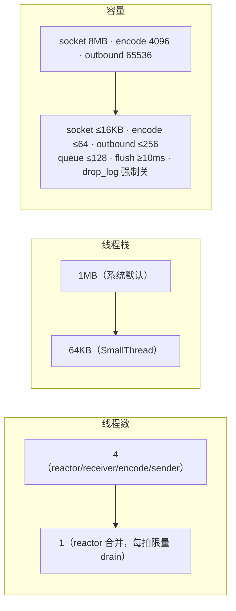
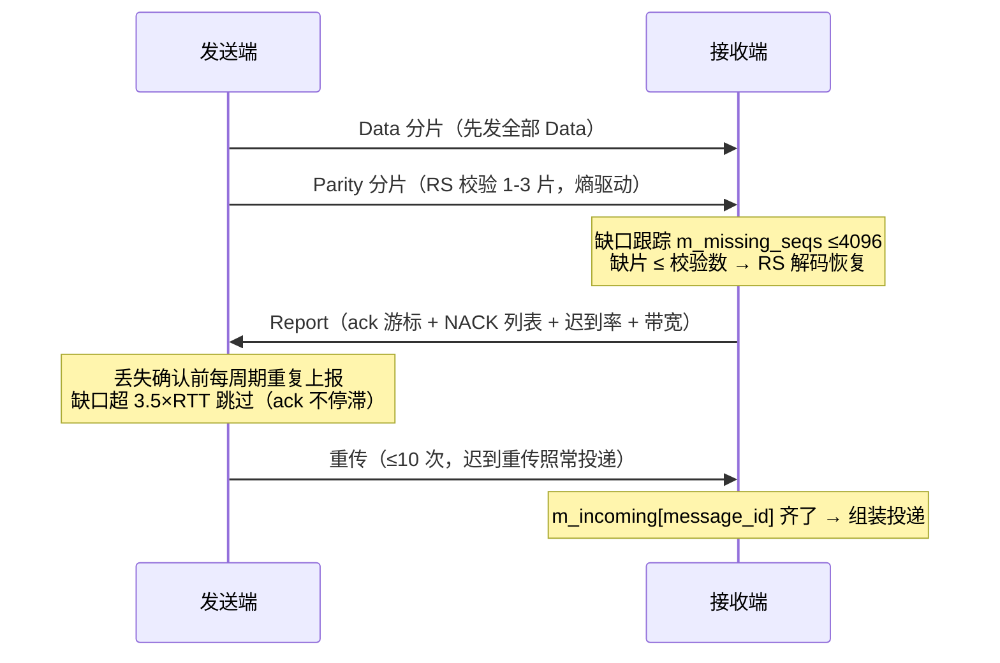
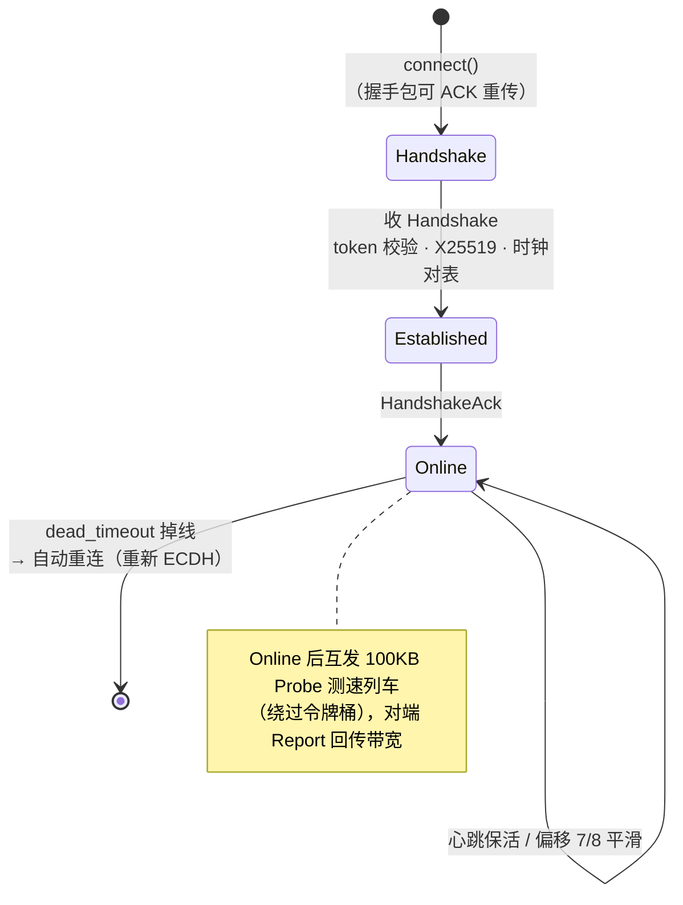

# Lite Mode 架构设计

## 1. 总体分层

lite mode 不改变分层，只收缩**传输编排层**的线程与资源配置。

## 2. 线程模型：普通模式 vs Lite 模式

### 2.1 普通模式（4 线程，`start()` `transport.cpp:334-341`）

| 线程 | 函数 | 职责 |
|---|---|---|
| reactor | `reactor_loop` (L464-486) | 节拍循环：send_handshakes / send_heartbeats / send_reports / check_offline / flush_commands / process_send_queue，sleep 到下一 `flush_interval()` |
| receiver | `receiver_loop` (L1096-1125) | 阻塞 `recvfrom` + 解码 + `handle_packet`；空闲短睡 500µs |
| encode | `encode_loop` (L1312-1328) | 消费 `m_encode_queue` 做分片 + RS FEC（CPU 密集与 reactor 解耦） |
| sender | `sender_loop` (L1127-1159) | 消费 `m_outbound_queue`，令牌桶 pacing 背压 |

### 2.2 Lite 模式（单线程 reactor 合并全部）

不 spawn 三个工作线程；`reactor_loop` 每拍末尾依次执行三个 drain
（`transport.cpp:473-477`）：

| drain | 位置 | 每拍限量 | 说明 |
|---|---|---|---|
| `drain_receiver` | L490-506 | 64 报文 | 非阻塞 socket，2048B 栈缓冲直接解码；限量防 reactor 饿死 |
| `drain_encode` | L509-515 | 16 任务 | 分片 + FEC |
| `drain_sender` | L519-541 | 64 报文 | 令牌不足时把当前报文留在 `m_lite_pending`（L87）下一拍再发，**不阻塞 reactor** |

**节拍间隔钳制**：lite 下 `flush_interval() ≥ 10ms`（L149-153），牺牲 ≤10ms 附加延迟换取
唤醒频率从 500 次/s 降到 100 次/s（省电）。

### 2.3 运行时切换的安全性（`Impl::set_lite_mode`，L157-209）

- **切 lite**：先 `m_lite_mode.store(true)` 让 reactor 接管合并职责，再
  `m_workers_running=false` 并 join 三个工作线程。过渡期 reactor 与工作线程
  **双消费同一队列/socket 是安全的**（L168-170 注释）。
- **切回普通**：先把 `m_lite_pending` 槽位中待发报文直接 `sendto` 掉（防滞留），
  先 spawn 工作线程再退出精简合并（防队列无人消费）。
- 同步原语：`m_workers_running`（原子）+ `m_workers_mutex`（串行化 spawn/join）。

## 3. 资源视图（lite 三轴收缩）

细节见 [03_api.md](03_api.md) §容量钳制表。

## 4. 可靠传输机制

### 4.1 序号与确认

- 数据包 `sequence` 来自 `Peer::m_sequence_out`；**消息组 `message_id` 用独立计数器
  `m_msg_id_out`**（`peer.hpp:53-57`：共用会产生幽灵序号导致 ack 冻结/内存泄漏）；
- 控制包（握手/Online）也可 ACK（`send_control ackable`）；独立 Ack 包用于握手类；
- `seq==0` 的 Parity 包不参与缺口跟踪/序列初始化（否则 ack 游标卡死泄漏）。

### 4.2 NACK / Report 重传

- Report 载荷格式（`report.hpp:7-14`）：
  `ack 游标 4B | 迟到率×10000 2B | 丢失数 2B | reserved 4B | 丢失序号 4B×N | 可选带宽 4B`；
- 接收侧缺口跟踪：`m_missing_seqs`/`m_recv_seqs`/`m_next_expected_seq`（`reassembler.cpp:67-92`），
  收线程与 reactor 双线程访问必须持 `peer.m_mu`；
- **丢失序号确认前每周期重复上报**；缺口超 **3.5×RTT** 即跳过（ack 不停滞），迟到重传照常投递；
- 每包最多重传 **10 次**（`kMaxRetries`），耗尽静默丢弃修剪 pending
  → **文件传输需应用层块校验 + 补发**；
- `m_missing_seqs` 硬上限 4096（`report.cpp:70-72`）。

### 4.3 重传协商（内存常数化的关键）

- 保留重传缓冲条件 = 本端 `retransmit_enabled` && 对端握手通告（`transport.cpp:1049-1050`）；
- 关闭侧不生成 NACK、缺口立即跳过（`report.cpp:46-52`）；
- 收益：在途内存 ∝ 码率 → **常数 ~24KB**（`types.hpp:101-107`、`usage.md:404-410`）。

### 4.4 分片 / FEC / 重组

- `Fragmenter::fragment_and_send`（`fragmenter.cpp:30-83`）：载荷 = mtu−48；分片宽度统一
  （尾部补零对齐 RS）；先发全部 Data 再发 Parity（最后一个分片类型为 Parity）；
- FEC 冗余率：迟到率 p 的二元熵 H(p)×1.2 安全系数，clamp [1,3]（`fragmenter.cpp:15-28`）；
  RS 为 GF(2⁸)/0x11D Vandermonde 擦除码；
- 重组：`m_incoming[message_id]` 收集分片，齐了直接组装；缺片 ≤ 校验数时 RS 解码恢复；
  流内 4B 大端总长前缀；
- 迟到判定：单向传输时间（时钟偏移换算）> `late_rtt_multiplier`×RTT（默认 4.0）。

### 4.5 拥塞控制与 pacing

- BBR 简化（`bandwidth.hpp:5-15`）：BtlBw 窗口最大 + RTprop 最小 RTT；
  RTT 趋势主增益 1.25/0.75，迟到率辅助否决；
- 令牌桶 pacing，上限 4×MTU（`transport.cpp:543-554`）。

### 4.6 命令通道

- 独立 `m_cmd_seq_out`，单报文不分片（≤ mtu−48），独立序列空间保序投递；
- 乱序最多等 3×RTT（`kMaxWaitRtt=3`）后跳过缺口；`send_command` 插队直进出站队列。

## 5. 线格式

48 字节头（`wire_format.hpp:13`），全大端：

| 偏移 | 字段 | 大小 |
|---|---|---|
| 0 | magic = 0x54474854 ("TGHT") | 4 |
| 4 | version = 1 | 1 |
| 5 | type (PacketType) | 1 |
| 6 | flags（bit15=0x8000 加密标记；数据报文低位 = data_cnt） | 2 |
| 8 | client_id | 4 |
| 12 | session_id | 8 |
| 20 | sequence | 4 |
| 24 | acknowledgment | 4 |
| 28 | message_id | 4 |
| 32 | fragment_index | 2 |
| 34 | fragment_count | 2 |
| 36 | payload_size | 2 |
| 38 | reserved（数据报文 = 真实分片长 real_size） | 2 |
| 40 | tick（unix ms 低 32 位，对表/RTT 用） | 4 |
| 44 | CRC32 | 4 |

`PacketType`：Handshake=0, HandshakeAck=1, Online=2, Heartbeat=3, Bye=4,
Data=5, Parity=6, Ack=7, Report=8, Probe=9, Command=10（`types.hpp:12-24`）。

## 6. 连接生命周期

## 7. 内存管理基础设施

- **buffer_pool**（`buffer_pool.hpp:3-10`）：thread_local 自由链表复用 2048B 固定块，
  每线程最多缓存 16 块（32KB），无锁、跨线程释放安全；出站报文用 `PooledBytes`；
- **零拷贝/少拷贝**：`encode_to/decode(ptr,len)`；接收直接栈缓冲解码；
  Fragmenter 用 `ReedSolomon::Span` 视图引用唯一整体缓冲；`encode_into` + thread_local
  缓冲复用；`build_wire_packet` 单缓冲构建（头→密文→CRC 一次分配）；
- **BlockingQueue**：有界 + `try_push` 非阻塞（发送路径绝不阻塞调用方）+ 节点回收池（上限 64）。
