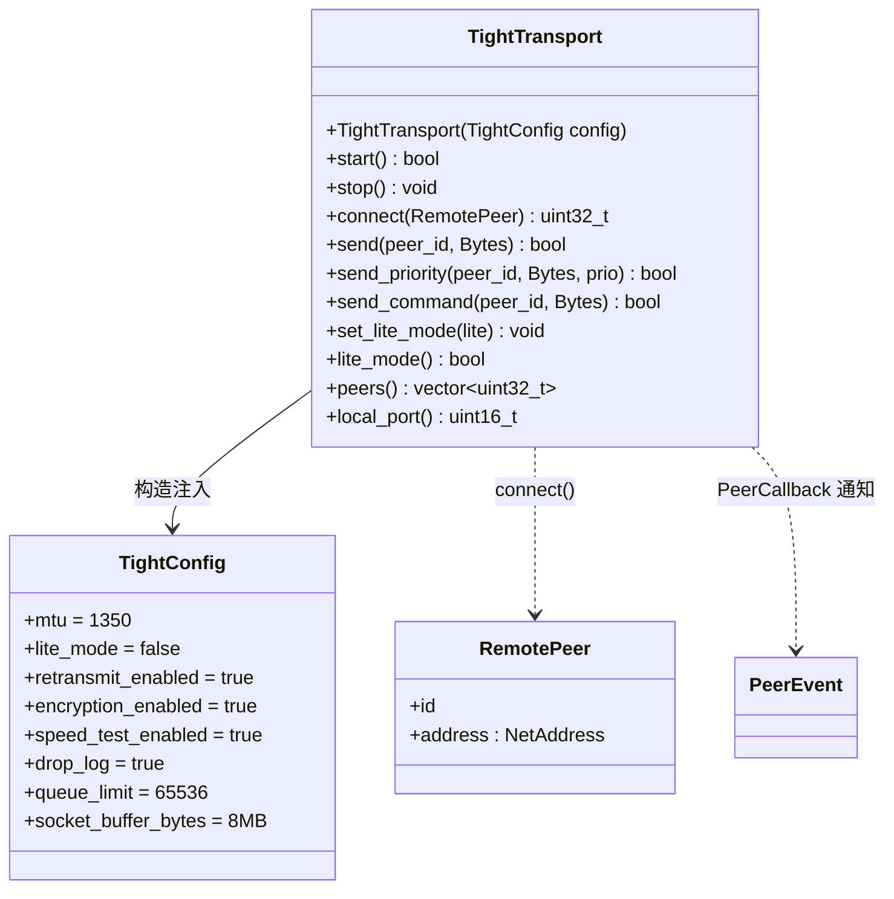

# Lite Mode API 设计

## 1. 公共 API 总览（`tight/include/tight/`）



### 1.1 主接口 `TightTransport`（tight.hpp，PIMPL）

```cpp
// 回调类型
using MessageCallback = std::function<void(uint32_t peer_id, Bytes msg)>;
using PeerCallback    = std::function<void(PeerEvent)>;
using CommandCallback = std::function<void(uint32_t peer_id, Bytes)>;

class TightTransport {
public:
    explicit TightTransport(TightConfig config);

    // 生命周期
    bool start();                                        // L32
    void stop();                                         // L33

    // 连接与发送
    uint32_t connect(const RemotePeer& peer);            // L35
    bool send(uint32_t peer_id, Bytes msg);              // L36
    bool send_priority(uint32_t peer_id, Bytes msg, int prio); // L37
    bool send_command(uint32_t peer_id, Bytes cmd);      // L45 单报文/插队/保序，乱序最多等 3×RTT

    // lite mode
    void set_lite_mode(bool lite);                       // L52
    bool lite_mode() const;                              // L53

    // 状态
    std::vector<uint32_t> peers() const;                 // L55
    uint16_t local_port() const;                         // L56
};
```

设计要点：
- **PIMPL**（`class Impl` + `unique_ptr`）：ABI 稳定，实现细节不外泄；
- **回调注入**：消息/对端事件/命令三个回调，无侵入业务层；
- **非阻塞发送**：`send` 走有界队列 `try_push`，队列满立即返回 false，绝不阻塞调用方。

### 1.2 配置 `TightConfig`（types.hpp:77-128，关键字段）

| 字段 | 默认 | 说明 |
|---|---|---|
| `mtu` | 1350 | 加密后载荷 1286B，恰容纳 16kHz PCM 40ms 帧 |
| `flush_interval` | — | 节拍间隔；lite 下钳制 ≥10ms（省电） |
| `drop_log` | true | 丢弃日志；lite 强制 false（静默丢弃） |
| `retransmit_enabled` | true | 可协商关闭，关闭后在途内存常数化 ~24KB |
| `max_message_bytes` | — | 钳制 [8KB, 10MB]，防内存耗尽 |
| `encryption_enabled` | true | X25519+AES-256-GCM |
| `speed_test_enabled` | true | Online 后 100KB Probe 测速 |
| `lite_mode` | false | **构造期初始值**（types.hpp:127） |
| `queue_limit` | 65536 | 应用发送队列消息数；lite 运行时 ≤128 |
| `socket_buffer_bytes` | 8MB | lite ≤16KB |
| `encode_queue_limit` | 4096 | lite ≤64（构造期钳制） |
| `outbound_queue_limit` | 65536 | lite ≤256（构造期钳制） |

### 1.3 辅助公共组件

| 组件 | 头文件 | 说明 |
|---|---|---|
| `ReedSolomon` | fec.hpp | `Span` 零拷贝视图，encode/encode_into/decode |
| `BandwidthEstimator` | bandwidth.hpp | `on_ack/on_late_ratio/seed_bandwidth/bytes_per_second/rtt` |
| `BlockingQueue<T>` | blocking_queue.hpp | push/try_push/take/take_for/poll/close，节点回收池 |
| `Logger` + `TIGHT_LOG_*` | logger.hpp | 日志宏 |

## 2. Lite Mode 开关语义

```cpp
void TightTransport::set_lite_mode(bool lite);  // tight.hpp:52
bool TightTransport::lite_mode() const;          // tight.hpp:53
```

- 实现链：`transport.cpp:1413`（转调）→ `Impl::set_lite_mode`（`transport.cpp:157-209`）；
- **本端本地属性**：不影响对端，两端模式可任意组合（`usage.md:400-401`）；
- `start()` 前后均可调用；切换只影响**线程模型**，队列容量构造时固定
  （`transport.cpp:155-156` 注释——内存预算确定性与切换安全性的折中）；
- 切换时同步刷新全量 peer 的 `m_drop_log = m_config.drop_log && !lite`（L161-166）。

## 3. Lite 容量钳制一览

| 资源 | 普通默认 | lite 上限 | 生效时机 | 代码位置 |
|---|---|---|---|---|
| `queue_limit` | 65536 | ≤128 | **运行时随模式动态** | `Impl::queue_limit()` transport.cpp:134-138 |
| `encode_queue_limit` | 4096 | ≤64 | 构造期 | transport.cpp:116-118 |
| `outbound_queue_limit` | 65536 | ≤256 | 构造期 | transport.cpp:119-121 |
| `socket_buffer_bytes` | 8MB | ≤16KB | start() | transport.cpp:301-303 |
| 线程栈 | 系统默认(Win 1MB) | 64KB | spawn 时 | `thread_stack()` transport.cpp:58-60；`SmallThread` small_thread.hpp:62-82 |
| `flush_interval` | 可低至 1-2ms | ≥10ms | 运行时随模式动态 | transport.cpp:149-153 |
| `drop_log` | true | 强制 false | 建 peer / set_lite_mode | transport.cpp:391 / 571 / 164 |
| 线程数 | 4 | 1 | start / set_lite_mode | transport.cpp:334-341 |

## 4. 典型用法

```cpp
tight::TightConfig cfg;
cfg.lite_mode = true;              // 构造期启用（容量钳制在 ctor 定型）
cfg.mtu = 1350;
cfg.retransmit_enabled = false;    // 纯实时 AV：在途内存常数化
cfg.speed_test_enabled = true;

tight::TightTransport t(cfg);
t.set_message_callback([](uint32_t id, tight::Bytes msg){ /* ... */ });
t.start();
uint32_t peer = t.connect({/* id, address */});
t.send(peer, audio_frame);

// 运行时也可切换（仅切线程模型）
t.set_lite_mode(false);
```

## 5. API 设计原则小结

1. **最小惊讶**：lite 只是本地资源档位，协议行为完全一致；
2. **失败显式**：发送失败返回 false（队列满），不静默缓存膨胀内存；
3. **确定性内存预算**：容量钳制集中在 ctor 与 start()，运行时不引入隐式分配点；
4. **可降级**：加密、重传、测速、日志均可独立关闭，按场景裁剪资源。
