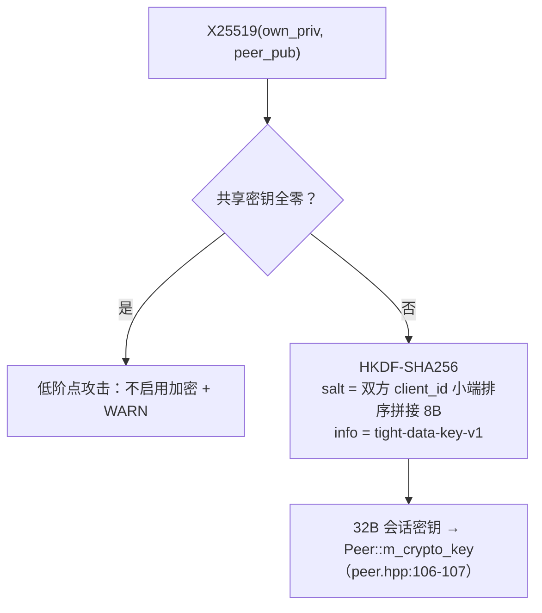
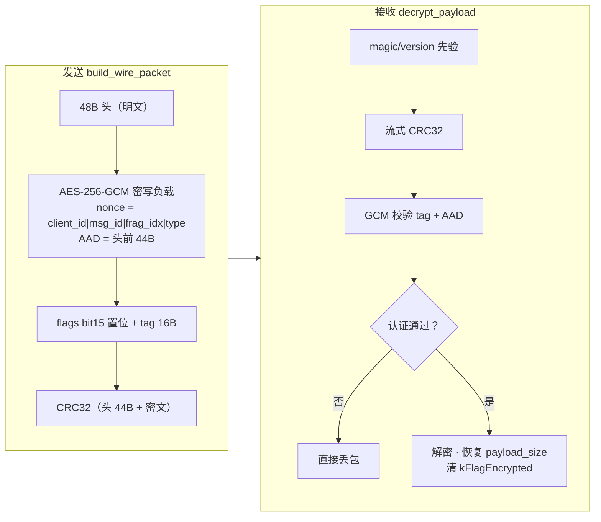

# Lite Mode 安全设计

> 安全机制为协议栈级能力，lite 与普通模式完全一致（lite 是本端资源档位）。
> 本节以 `tight/src/crypto.hpp:1-11` 头部注释为权威描述。

## 1. 密码套件

**纯 C++ 自实现、零外部依赖**（便于嵌入式交叉编译，无 OpenSSL 依赖）：

| 原语 | 标准 | 用途 |
|---|---|---|
| X25519 | RFC 7748（Curve25519 Montgomery 阶梯，5×51-bit limb + `__int128`，crypto.cpp:164） | ECDH 密钥交换 |
| SHA-256 | FIPS 180-4 | HKDF 底层哈希 |
| HKDF-SHA256 | RFC 5869 | 会话密钥派生 |
| AES-256-GCM | FIPS 197 + NIST SP 800-38D（S 盒运行时生成，GHASH 约减多项式 x¹²⁸+x⁷+x²+x+1，crypto.cpp:410-660） | AEAD 数据加密 |

开关：`TightConfig::encryption_enabled{true}`（types.hpp:118）。

## 2. 握手与密钥协商

### 2.1 握手载荷（transport.cpp:914-933）

```
[role 1B][id_len 2B BE][id][token][X25519 pubkey 32B?][flags 1B]
                                                  └ bit0 = retransmit_enabled 能力通告
```

### 2.2 校验与防御（`handle_handshake`，transport.cpp:627-674）

- **token 比对**：预共享令牌不匹配直接 return（L651）——接入认证；
- **匿名身份对称**：空 id 保留 `anon-*` 身份，保证 ECDH 双方行为对称（L657-660）。

### 2.3 会话密钥派生（`derive_session_key`，transport.cpp:937-954）





## 3. AEAD 加密传输

- **标记**：`kFlagEncrypted = 0x8000`（wire_format.hpp:17），复用 flags 高位；
  低位保留原语义（数据报文 = data_cnt）；**报文头始终明文**（transport.cpp:595）；
- **nonce 12B**（transport.cpp:960-977，全大端，确定性构造，同包唯一）：
  - Data/Parity：`client_id | message_id | fragment_index | type | 0`
  - Command：`client_id | sequence | type | 0,0,0`
- **AAD** = 报文头前 44 字节（不含 CRC 域）：头部任何篡改 → GCM tag 校验失败；
- **tag** 16B 附于密文尾部；密文开销 +16B（mtu 1350 → 载荷 1286B）；
- 发送路径 `build_wire_packet`（transport.cpp:982-1005）：单缓冲构建——头 → AES 直接密写进
  报文负载区 → CRC，一次分配；
- 接收路径 `decrypt_payload`（transport.cpp:1008-1026）：解密后恢复 `payload_size` 并清
  `kFlagEncrypted` 位；**认证失败直接丢包**（transport.cpp:596-600）。

## 4. 完整性校验（独立于加密层）

| 机制 | 说明 | 位置 |
|---|---|---|
| magic 校验 | `0x54474854`("TGHT") + version 1，解码先验 | packet_codec.cpp:94-97 |
| CRC32 | IEEE 802.3 查表，覆盖「头 44B（CRC 域清零）+ 负载」；解码用**流式 CRC**（头 44B + 4 零字节 + 负载，免拼接临时缓冲） | crc32.cpp、packet_codec.cpp:48-55/118-123 |
| AAD 绑定 | 见 §3 | transport.cpp:998/1017 |

双校验的意义：未加密报文（加密关闭部署）仍有 CRC32 防线路噪声；加密报文由 GCM tag
提供强完整性。

## 5. 资源耗尽防御（安全与内存的交叉点）

| 攻击面 | 防御 | 位置 |
|---|---|---|
| 超大 message 声明 | `max_message_bytes` 钳制 [8KB, 10MB] | transport.cpp:141-145 |
| 伪造 fragment_count | `fragment_count ≤ max_message_bytes/64 + 8` | reassembler.cpp:106-112 |
| 伪造缺口序列洪水 | `m_missing_seqs` 硬上限 4096 | report.cpp:70-72 |
| 日志洪水 | drop 日志每 peer 每秒限流一条；lite 强制静默 | reassembler.cpp:19-29；transport.cpp:164 |
| 队列积压 | 全部队列有界 + try_push，满即拒收 | blocking_queue.hpp |

## 6. 时钟对表（安全相关：防 replay 辅助）

握手/心跳对表：offset = remote − local，减 RTT/2，心跳按 7/8 平滑跟踪漂移
（transport.cpp:756-780）。tick 字段为 unix ms 低 32 位，服务于迟到判定与 RTT 估算。

## 7. 已知边界（设计取舍）

1. **无 PFS 轮换**：会话密钥生命周期 = 连接生命周期，无周期轮换；断线重连重新 ECDH；
2. **nonce 复用前提**：nonce 由确定性字段构造，同一 (client_id, message_id, fragment_index)
   组合唯一——依赖 message_id 单调计数器不变量；
3. **握手包本身不加密**：身份 id 与 token 明文在线；token 仅为接入门槛而非保密凭据，
   高安全场景应在上层叠加应用层认证；
4. **低阶点防御已内置**：X25519 结果全零检测，拒绝退化共享密钥。
